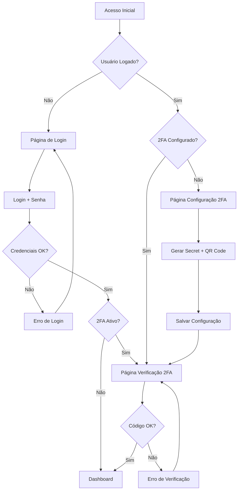

# 🔐 Sistema de Autenticação com 2FA

> Um sistema completo de autenticação com dois fatores (2FA) construído com Next.js 16, TypeScript e Tailwind CSS. Inclui login seguro, configuração TOTP, QR codes, códigos de backup e dashboard moderno.

## 🚀 Demonstração

### 📱 Screenshots

<div align="center">
  
  
  
  
</div>

### 🎯 Funcionalidades Principais

- 🔐 **Login Seguro** - Autenticação com JWT e hash de senhas
- 🛡️ **2FA/TOTP** - Autenticação de dois fatores com Google Authenticator
- 📱 **QR Codes** - Configuração fácil com QR codes
- 🔑 **Códigos de Backup** - 10 códigos por usuário para recuperação
- 📊 **Dashboard Moderno** - Interface responsiva e intuitiva
- 🚀 **Serverless Ready** - Compatível com Vercel e outras plataformas
- 🐳 **Docker Support** - Containerização pronta para produção
- 📱 **Mobile First** - Design responsivo para todos os dispositivos

## 📋 Conteúdo

- [🏗️ Arquitetura](#-arquitetura)
- [🚀 Quick Start](#-quick-start)
- [📦 Instalação](#-instalação)
- [⚙️ Configuração](#️-configuração)
- [🔐 Fluxo de Autenticação](#-fluxo-de-autenticação)
- [📱 Interface do Usuário](#-interface-do-usuário)
- [🛡️ Segurança](#️-segurança)
- [🚀 Deploy](#-deploy)
- [🧪 Testes](#-testes)
- [📚 API Reference](#-api-reference)
- [🐛 Troubleshooting](#-troubleshooting)
- [🤝 Contribuição](#-contribuição)

---

## 🏗️ Arquitetura

```
src/
├── app/                    # App Router (Next.js 13+)
│   ├── api/               # API Routes
│   │   ├── auth/          # Autenticação principal
│   │   └── 2fa/          # Configuração 2FA
│   ├── login/            # Página de login
│   ├── 2fa-setup/        # Configuração 2FA
│   ├── 2fa-verify/       # Verificação 2FA
│   ├── simulator/        # Dashboard do usuário
│   ├── layout.tsx         # Layout principal
│   ├── page.tsx          # Redirecionamento
│   └── globals.css       # Estilos globais
├── components/            # Componentes reutilizáveis
│   ├── ui/              # shadcn/ui components
│   └── protected-route.tsx
├── lib/                 # Bibliotecas e utilitários
│   ├── auth-system.ts    # Sistema de autenticação
│   └── utils.ts         # Utilitários gerais
└── hooks/               # React hooks personalizados
    ├── use-auth.tsx      # Hook de autenticação
    └── use-mobile.ts     # Hook de responsividade
```

### 🛠️ Stack Tecnológico

| Categoria | Tecnologia | Versão | Descrição |
|----------|------------|---------|------------|
| **Framework** | Next.js | 16.0.10 | React framework com App Router |
| **Frontend** | React | 19.2.0 | Biblioteca de UI |
| **Linguagem** | TypeScript | 5.9.3 | Tipagem estática |
| **Estilos** | Tailwind CSS | 4.1.17 | CSS utility-first |
| **UI Components** | shadcn/ui | - | Componentes modernos |
| **Ícones** | Lucide React | 0.525.0 | Ícones consistentes |
| **Autenticação** | JWT | - | Tokens seguros |
| **2FA** | OTP Auth | 12.0.1 | TOTP implementation |
| **QR Codes** | QRCode | 1.5.4 | QR code generation |
| **Hash** | bcryptjs | 2.4.3 | Password hashing |
| **Deploy** | Docker | - | Containerização |

---

## 🚀 Quick Start

### 🎯 Demo Rápida (5 minutos)

1. **Clone o repositório**
   ```bash
   git clone <repository-url>
   cd auth-system-2fa
   ```

2. **Instale as dependências**
   ```bash
   npm install
   ```

3. **Inicie o servidor de desenvolvimento**
   ```bash
   npm run dev
   ```

4. **Acesse a aplicação**
   ```
   http://localhost:3000
   ```

### 🔑 Credenciais de Teste

| Tipo | E-mail | Senha | 2FA |
|------|---------|--------|------|
| **Admin** | `admin@quattre.com` | `admin123` | Não configurado |
| **Corretor** | `corretor@quattre.com` | `corretor123` | Não configurado |
| **2FA Test** | `user@quattre.com` | `user123` | **Configurado** (código: `123456`) |

---

## 📦 Instalação

### 📋 Pré-requisitos

- **Node.js**: >= 18.0.0
- **NPM**: >= 8.0.0
- **Git**: Para controle de versão

### 🔧 Instalação Manual

```bash
# 1. Clone o repositório
git clone <repository-url>
cd auth-system-2fa

# 2. Instale as dependências
npm install

# 3. Configure as variáveis de ambiente
cp .env.example .env
# Edite o arquivo .env com suas configurações

# 4. Inicie o desenvolvimento
npm run dev
```

### 🐳 Instalação com Docker

```bash
# 1. Build da imagem
docker build -t auth-system-2fa .

# 2. Execute com docker-compose
docker-compose up -d

# 3. Acesse a aplicação
http://localhost:3000
```

---

## ⚙️ Configuração

### 📄 Variáveis de Ambiente

Crie um arquivo `.env` na raiz do projeto:

```env
# JWT Configuration
JWT_SECRET="your-super-secret-jwt-key-change-in-production-256-bits-minimum"

# 2FA Configuration
TOTP_ISSUER="Sistema de Autenticação"
TOTP_WINDOW=1

# Application Configuration
NODE_ENV="production"
NEXTAUTH_URL="https://your-domain.com"

# Security Configuration
BCRYPT_ROUNDS=12
SESSION_TIMEOUT=1800000

# Rate Limiting
RATE_LIMIT_WINDOW_MS=900000
RATE_LIMIT_MAX_REQUESTS=100

# CORS Configuration
ALLOWED_ORIGINS="https://your-domain.com,https://www.your-domain.com"

# Monitoring
LOG_LEVEL="info"
```

### 🔧 Scripts Disponíveis

```json
{
  "scripts": {
    "dev": "next dev -p 3000",
    "build": "next build",
    "start": "next start",
    "lint": "next lint"
  }
}
```

---

## 🔐 Fluxo de Autenticação

### 🔄 Fluxo Completo



### 📋 Etapas Detalhadas

1. **Acesso Inicial**
   - Usuário acessa `/` → Redirecionado para `/login`

2. **Login**
   - Usuário insere e-mail e senha
   - Sistema valida credenciais
   - Gera token JWT

3. **Verificação 2FA**
   - **Se 2FA não configurado**: Redirecionado para `/2fa-setup`
   - **Se 2FA configurado**: Redirecionado para `/2fa-verify`

4. **Configuração 2FA** (primeiro acesso)
   - Gera secret TOTP
   - Exibe QR code para apps autenticadores
   - Fornece 10 códigos de backup
   - Usuário insere código para confirmar

5. **Verificação 2FA** (acessos subsequentes)
   - Usuário insere código de 6 dígitos
   - Sistema valida código TOTP
   - Gera token de sessão completo

6. **Acesso ao Dashboard**
   - Usuário acessa `/simulator`
   - Sistema valida token e 2FA
   - Exibe interface do usuário

---

## 📱 Interface do Usuário

### 🎨 Design System

- **Cores**: Gradientes modernos com tema profissional
- **Tipografia**: Inter font para melhor legibilidade
- **Componentes**: shadcn/ui para consistência visual
- **Responsividade**: Mobile-first approach
- **Acessibilidade**: ARIA labels e navegação por teclado

### 📱 Páginas

#### 🔑 Página de Login (`/login`)
- Formulário de e-mail e senha
- Validação em tempo real
- Indicadores de loading
- Links para recuperação de senha
- Informações de usuários de teste

#### ⚙️ Configuração 2FA (`/2fa-setup`)
- QR code para configuração fácil
- Secret manual para apps sem câmera
- 10 códigos de backup
- Instruções passo a passo
- Validação de código

#### 🔍 Verificação 2FA (`/2fa-verify`)
- Input de 6 dígitos para código TOTP
- Opção para usar código de backup
- Feedback visual claro
- Redirecionamento automático

#### 📊 Dashboard (`/simulator`)
- Estatísticas em tempo real
- Lista de transações recentes
- Gráficos e visualizações
- Ações rápidas
- Menu do usuário

### 🎯 Componentes UI

#### Botões
- Variações: primary, secondary, outline
- Estados: default, loading, disabled
- Tamanhos: sm, md, lg
- Feedback visual com ícones

#### Forms
- Inputs com validação
- Labels acessíveis
- Mensagens de erro
- Estados de loading

#### Cards
- Layouts flexíveis
- Sombras consistentes
- Hover effects
- Bordas arredondadas

---

## 🛡️ Segurança

### 🔒 Medidas de Segurança Implementadas

#### 🔐 Autenticação
- **Hash de senhas**: bcrypt com 12 rounds
- **Tokens JWT**: Assinados com expiração
- **Rate limiting**: 5 tentativas por 15 minutos
- **Sessões**: Gerenciamento automático

#### 🛡️ 2FA/TOTP
- **Algoritmo**: RFC 6238 compliant
- **Tolerância**: ±30 segundos
- **Backup codes**: 10 códigos únicos
- **QR codes**: Para configuração fácil

#### 🌐 Segurança Web
- **Headers HTTP**: X-Frame-Options, XSS Protection
- **CORS**: Configurado para domínios específicos
- **CSRF**: Proteção com tokens
- **Input validation**: Sanitização completa

#### 📊 Auditoria
- **Logging**: Registro de todas as ações
- **Error tracking**: Captura de exceções
- **Security events**: Tentativas de acesso
- **User actions**: Alterações importantes

### 🔐 Best Practices

1. **Senhas Fortes**
   - Mínimo 8 caracteres
   - Letras maiúsculas e minúsculas
   - Números e caracteres especiais

2. **2FA Obrigatório**
   - Configuração após primeiro login
   - Códigos de backup seguros
   - Apps autenticadores verificados

3. **Sessões Seguras**
   - Tokens com expiração curta
   - Refresh automático
   - Logout em todos os dispositivos

4. **Monitoramento**
   - Logs de acesso
   - Tentativas falhas
   - Ações suspeitas

---

## 🚀 Deploy

### 🌐 Deploy na Vercel

#### 1. Preparação
```bash
# 1. Build do projeto
npm run build

# 2. Teste local
npm start

# 3. Configure variáveis de ambiente
# No dashboard Vercel
```

#### 2. Deploy Automático
```bash
# Instalar Vercel CLI
npm i -g vercel

# Deploy para produção
vercel --prod

# Configurar variáveis de ambiente
vercel env add JWT_SECRET
vercel env add TOTP_ISSUER
```

#### 3. Configuração no Dashboard Vercel
1. Acesse [vercel.com](https://vercel.com)
2. Importe o repositório
3. Configure as variáveis de ambiente
4. Configure domínio personalizado (opcional)

### 🐳 Deploy com Docker

#### 1. Build da Imagem
```bash
# Build otimizado
docker build -t auth-system-2fa .

# Build multi-stage (produção)
docker build --target runner -t auth-system-2fa:latest .
```

#### 2. Deploy com Docker Compose
```bash
# Iniciar todos os serviços
docker-compose up -d

# Verificar logs
docker-compose logs -f

# Escalar (se necessário)
docker-compose up -d --scale app=3
```

#### 3. Dockerfile Otimizado
```dockerfile
# Multi-stage build
FROM node:18-alpine AS builder
# Instalar dependências e build

FROM node:18-alpine AS runner
# Copiar apenas arquivos necessários
# Configurar ambiente de produção
```

### ☁️ Outras Plataformas

#### Railway
```bash
# Instalar CLI
npm install -g @railway/cli

# Deploy
railway login
railway link
railway up
```

#### Netlify
```bash
# Build estático
npm run build

# Deploy com CLI
netlify deploy --prod --dir=.next
```

#### DigitalOcean App Platform
```bash
# Instalar doctl
curl -sSL https://do.dev/cli | sh

# Deploy
doctl apps create --spec web
doctl apps deploy
```

---

## 🧪 Testes

### 🧪 Testes Manuais

#### 1. Teste de Login
```bash
# Teste com credenciais válidas
curl -X POST http://localhost:3000/api/auth/login \
  -H "Content-Type: application/json" \
  -d '{"email":"admin@quattre.com","password":"admin123"}'

# Teste com credenciais inválidas
curl -X POST http://localhost:3000/api/auth/login \
  -H "Content-Type: application/json" \
  -d '{"email":"invalid@test.com","password":"wrong"}'
```

#### 2. Teste de 2FA
```bash
# Configurar 2FA
curl -X POST http://localhost:3000/api/2fa/setup \
  -H "Content-Type: application/json" \
  -H "Authorization: Bearer <token>" \
  -d '{"userId":"user-id"}'

# Verificar código 2FA
curl -X POST http://localhost:3000/api/2fa/verify \
  -H "Content-Type: application/json" \
  -H "Authorization: Bearer <temp-token>" \
  -d '{"userId":"user-id","code":"123456"}'
```

#### 3. Teste de Rate Limiting
```bash
# Tentativas múltiplas (deve bloquear após 5)
for i in {1..6}; do
  curl -X POST http://localhost:3000/api/auth/login \
    -H "Content-Type: application/json" \
    -d '{"email":"test@test.com","password":"wrong"}'
done
```

### 🧪 Testes Automatizados

#### Cypress (E2E)
```bash
# Instalar Cypress
npm install --save-dev cypress

# Configurar Cypress
npx cypress open

# Executar testes
npx cypress run
```

#### Jest (Unit)
```bash
# Instalar Jest
npm install --save-dev jest @testing-library/react @testing-library/jest-dom

# Executar testes
npm test
```

---

## 📚 API Reference

### 🔐 Autenticação

#### POST `/api/auth/login`
Login de usuário com e-mail e senha.

**Request:**
```json
{
  "email": "user@quattre.com",
  "password": "user123"
}
```

**Response (200):**
```json
{
  "success": true,
  "token": "jwt-token",
  "user": {
    "id": "user-id",
    "email": "user@quattre.com",
    "name": "User Name",
    "role": "user",
    "isAdmin": false,
    "twoFactorEnabled": false
  }
}
```

**Response (401):**
```json
{
  "success": false,
  "message": "E-mail ou senha incorretos"
}
```

#### POST `/api/auth/verify`
Verificação de token de autenticação.

**Request:**
```bash
curl -X GET http://localhost:3000/api/auth/verify \
  -H "Authorization: Bearer <jwt-token>"
```

**Response (200):**
```json
{
  "authenticated": true,
  "twoFactorVerified": true,
  "user": {
    "id": "user-id",
    "email": "user@quattre.com",
    "name": "User Name",
    "role": "user",
    "isAdmin": false,
    "twoFactorEnabled": true
  }
}
```

### 🛡️ 2FA

#### POST `/api/2fa/setup`
Inicia configuração de 2FA para o usuário.

**Request:**
```json
{
  "userId": "user-id"
}
```

**Response (200):**
```json
{
  "success": true,
  "secret": "JBSWY3DPEHPK3PXP",
  "qrCode": "data:image/png;base64,iVBORw0KGgoAAAANSUhEUgAA...",
  "backupCodes": ["ABC123", "DEF456", "GHI789", ...]
}
```

#### PUT `/api/2fa/setup`
Confirma e ativa 2FA com código verificado.

**Request:**
```json
{
  "userId": "user-id",
  "code": "123456",
  "secret": "JBSWY3DPEHPK3PXP"
}
```

**Response (200):**
```json
{
  "success": true,
  "verified": true,
  "message": "2FA configurado com sucesso"
}
```

#### POST `/api/2fa/verify`
Verifica código 2FA durante login.

**Request:**
```json
{
  "userId": "user-id",
  "code": "123456"
}
```

**Response (200):**
```json
{
  "success": true,
  "verified": true,
  "token": "session-jwt-token",
  "message": "Verificação 2FA concluída com sucesso"
}
```

---

## 🐛 Troubleshooting

### 🔧 Problemas Comuns

#### ❌ Build Falha
**Problema:** Erro de compilação
```bash
Error: Cannot find module '@tailwindcss/postcss'
```

**Solução:**
```bash
npm install @tailwindcss/postcss
```

#### ❌ 2FA Não Funciona
**Problema:** Código TOTP inválido
```
Código inválido
```

**Solução:**
1. Verifique o horário do servidor
2. Use código de backup para teste
3. Confirme configuração do app autenticador

#### ❌ Login Não Funciona
**Problema:** Token JWT inválido
```
Token inválido ou expirado
```

**Solução:**
1. Verifique JWT_SECRET no .env
2. Limpe cookies e localStorage
3. Faça login novamente

#### ❌ Rate Limiting
**Problema:** Muitas tentativas bloqueadas
```
Muitas tentativas de login. Tente novamente mais tarde.
```

**Solução:**
1. Aguarde 15 minutos
2. Use credenciais corretas
3. Verifique logs de auditoria

### 🛠️ Debug Mode

#### Ativar Logs Detalhados
```env
LOG_LEVEL="debug"
```

#### Verificar Logs
```bash
# Logs do servidor
npm run dev

# Logs de build
npm run build

# Logs de produção
docker-compose logs -f
```

### 📝 Performance Issues

#### Build Lento
**Soluções:**
1. Use cache do npm
2. Limpe node_modules
3. Verifique dependências desnecessárias

#### Runtime Lento
**Soluções:**
1. Otimize imagens
2. Use lazy loading
3. Verifique queries ao banco

---

## 🤝 Contribuição

### 📋 Como Contribuir

1. **Fork o repositório**
   ```bash
   git clone https://github.com/your-username/auth-system-2fa.git
   cd auth-system-2fa
   ```

2. **Crie uma branch**
   ```bash
   git checkout -b feature/nova-funcionalidade
   ```

3. **Faça as alterações**
   - Siga os padrões de código
   - Adicione testes
   - Documente as mudanças

4. **Commit as mudanças**
   ```bash
   git add .
   git commit -m "feat: adicionar nova funcionalidade"
   ```

5. **Abra um Pull Request**
   - Descreva as mudanças
   - Adicione screenshots
   - Inclua testes

### 📝 Padrões de Código

#### TypeScript
```typescript
// Use interfaces para tipos
interface User {
  id: string;
  email: string;
  name: string;
}

// Use enums para valores fixos
enum UserRole {
  ADMIN = 'ADMIN',
  USER = 'USER'
}
```

#### React
```tsx
// Use hooks personalizados
const { user, login, logout } = useAuth();

// Use componentes reutilizáveis
<Button onClick={login} disabled={loading}>
  Entrar
</Button>
```

#### CSS/Tailwind
```tsx
// Use classes consistentes
<div className="flex items-center justify-center p-4">
  <Card className="w-full max-w-md">
    <CardHeader>
      <CardTitle>Login</CardTitle>
    </CardHeader>
    <CardContent>
      {/* Form content */}
    </CardContent>
  </Card>
</div>
```

### 🧪 Testes

#### Unit Tests
```typescript
// Teste de funções puras
describe('TokenManager', () => {
  it('should generate valid token', () => {
    const token = TokenManager.generateSessionToken(mockUser);
    expect(token).toBeDefined();
  });
});
```

#### Integration Tests
```typescript
// Teste de API endpoints
describe('POST /api/auth/login', () => {
  it('should authenticate valid user', async () => {
    const response = await request(app)
      .post('/api/auth/login')
      .send({ email: 'test@test.com', password: 'test123' });
    
    expect(response.status).toBe(200);
    expect(response.body.success).toBe(true);
  });
});
```

### 📋 Checklist de Contribuição

- [ ] Código segue os padrões do projeto
- [ ] Testes adicionados/atualizados
- [ ] Documentação atualizada
- [ ] Build funciona sem erros
- [ ] Testes passam com sucesso
- [ ] Sem vulnerabilidades de segurança
- [ ] Performance mantida ou melhorada

---

## 📄 Licença

Este projeto está licenciado sob a **MIT License**. Veja o arquivo [LICENSE](LICENSE) para mais detalhes.

---

## 👥 Créditos

### 🏢 Frameworks e Bibliotecas
- [Next.js](https://nextjs.org/) - Framework React
- [React](https://reactjs.org/) - Biblioteca de UI
- [TypeScript](https://www.typescriptlang.org/) - Tipagem estática
- [Tailwind CSS](https://tailwindcss.com/) - Framework CSS
- [shadcn/ui](https://ui.shadcn.com/) - Componentes UI

### 🔐 Segurança
- [bcryptjs](https://www.npmjs.com/package/bcryptjs) - Hash de senhas
- [jsonwebtoken](https://www.npmjs.com/package/jsonwebtoken) - Tokens JWT
- [otplib](https://www.npmjs.com/package/otplib) - Autenticação 2FA
- [qrcode](https://www.npmjs.com/package/qrcode) - Geração de QR codes

### 🎨 Design
- [Lucide](https://lucide.dev/) - Ícones
- [Inter](https://rsms.me/inter/) - Tipografia

### 🐳 Deploy
- [Docker](https://www.docker.com/) - Containerização
- [Vercel](https://vercel.com/) - Plataforma de deploy

---

## 📞 Suporte

### 🐛 Reportar Bugs
- Abra uma issue no [GitHub Issues](https://github.com/your-username/auth-system-2fa/issues)
- Inclua detalhes do erro
- Adicione screenshots se possível
- Informe o ambiente (SO, navegador, etc.)

### 💡 Sugestões e Melhorias
- Abra uma issue com label `enhancement`
- Descreva a melhoria sugerida
- Explique o caso de uso
- Considere contribuir com PR

### 📧 Contato
- **Email**: contato@seudominio.com
- **Twitter**: [@seuhandle](https://twitter.com/seuhandle)
- **LinkedIn**: [seu-perfil](https://linkedin.com/in/seuperfil)

---

<div align="center">

### 🌟 Se este projeto foi útil, considere:

- ⭐ **Star** o repositório
- 🍴 **Fork** para contribuir
- 🔄 **Share** com outros desenvolvedores
- 💬 **Feedback** para melhorias

---

**Desenvolvido com ❤️ por [Seu Nome](https://github.com/seuusername)**

</div>